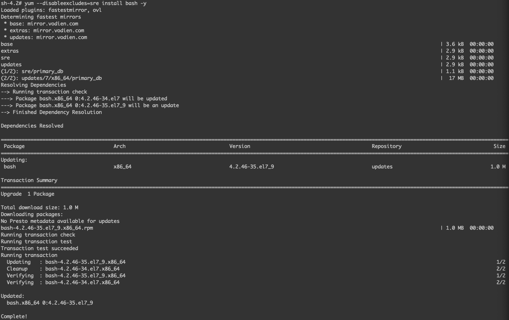
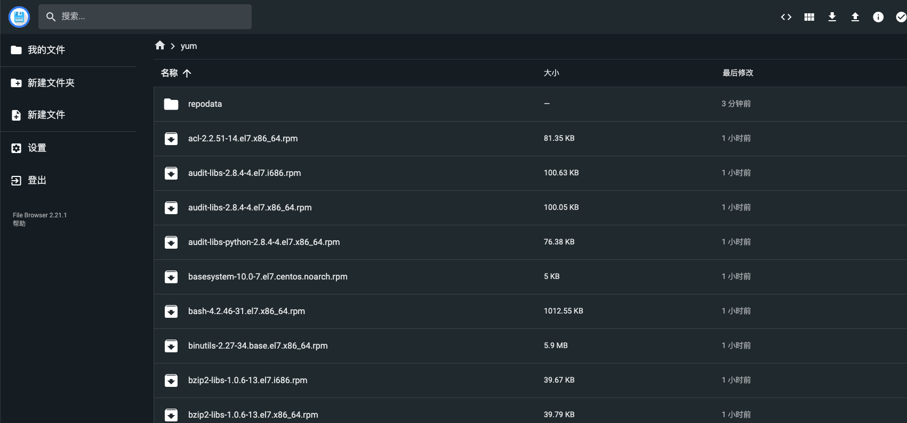
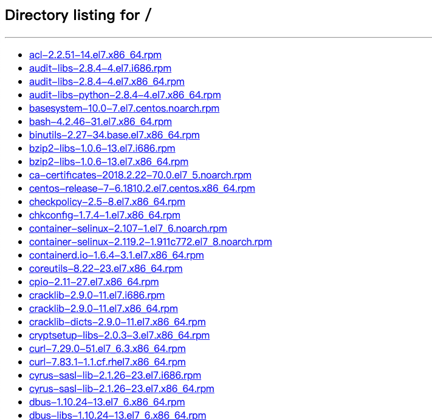

# yum-with-browser

## Overview

[yum-with-browser](https://github.com/runzhliu/yum-with-browser) aims to solve some yum source problems in the k8s cluster. For Chinese docs, please refert to [ÖÐÎÄ](./README_ZH.md).

Why is there such a problem? Generally speaking, the k8s cluster only has a cluster network and cannot directly connect to the Internet, or even the company's LAN. Therefore, when some students use k8s to deploy applications, especially those who use k8s as a virtual machine, they will find it troublesome to install software, because the usual process may only be to install the software that needs to be installed in the Dockerfile. Such as vim, curl and so on.

This project has no code, just deploys a privatized yum source by deploying a k8s workload, and **provides file browser** management, which is really important, compared to the common use of Nginx or httpd to create a private source, a web browser with a file manager would be great (provided at least the service is exposed via Nodeport, of course).

## Deploy

Deployment is very simple, given a [yum-with-browser.yaml](yum-with-browser.yaml) with temporary storage, all logic is in [Dockerfile](Dockerfile), after startup, the default NodePort of filebrowser The port is 32600. If yum-with-browser is a long-term source in the cluster, it is recommended to use a persistent storage solution to store the rpm package.

```shell
kubectl apply -f yum-with-browser.yaml
````

The following is the method used, the yum source is exposed through port 8080 of the Service.

```shell
# access within the container only requires the svc name, and the default port is 8080
cat >> /etc/yum.repos.d/sre.repo <<EOF
[sre]
name=sre yum repos
baseurl=http://yum-with-browser:8080
enable=1
gpgcheck=0
EOF
# upload a rpm for bash
yum --disableexcludes=sre install bash -y
```

After that, just create a centos Pod, you can directly enter the yum container in yum-with-browser, and try to install it directly. The final result is as follows.



## Notes

Of course, not such a warehouse can allow any software to be installed in the container. This has something to do with the Linux version of the base image in the container itself, the kernel version, and the software already in the base image.

Recompiling the image can be achieved by the following command.

```shell
DOCKER_BUILDKIT=1 docker build -t runzhliu/yum-with-browser . --progress=plain
```




