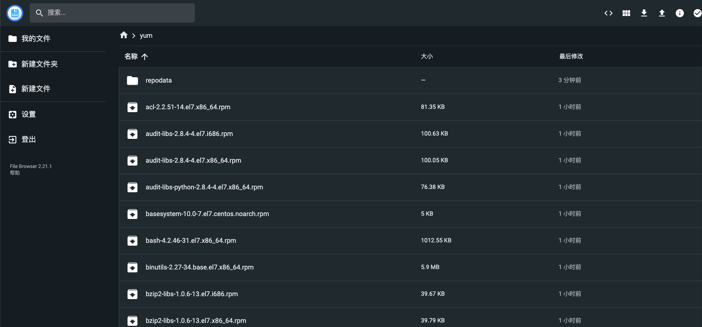
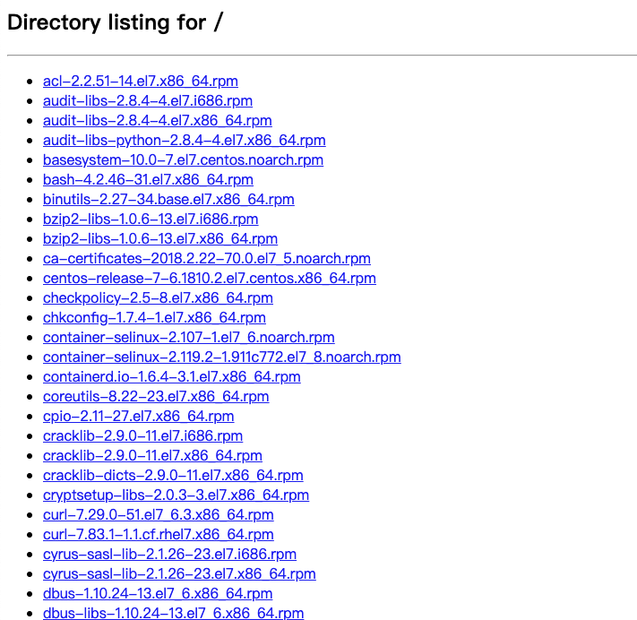

# yum-with-browser

## Overview

The purpose is to solve some yum source problems in the k8s cluster.

Why is there such a problem? Generally speaking, k8s clusters only have a cluster network and cannot directly connect to the Internet, and even the company's LAN may not be able to connect. Therefore, when some students use k8s to deploy applications, especially those who use k8s as a virtual machine, they will find it very troublesome to install software, because the usual process may be to install the software that needs to be installed only in the Dockerfile. For example vim, curl etc.

There is no code in this project, it just deploys a private yum source by deploying a k8s workload, and **provides the management of the file browser**, which is really important, compared to the common use of Nginx
Or httpd to create a private source, a web browser with a file manager would be nice (provided that at least the service can be exposed via Nodeport).

## Deploy

Deployment is very simple, everything is in [Dockerfile](Dockerfile)
```shell
# Command line to start yum server and file browser
kubectl run yum --image=runzhliu/sre-yum:latest --image-pull-policy=Always
kubectl run yum-file-browser --image=filebrowser/filebrowser --image-pull-policy=Always
kubectl expose po yum-with-browser --name=yum-with-browser --port=80 --target-port=80 --type=NodePort
kubectl expose po yum --name=yum --port=80 --target-port=8080 # 镜像里默认python的http server是8080

# Only the svc name is required for access in the container, and the default port is 80.
cat >> /etc/yum.repos.d/sre.repo <<EOF
[sre]
name=sre yum repos
baseurl=http://yum
enable=1
gpgcheck=0
EOF
# Upload an rpm package
yum --disableexcludes=sre install vim -y
```

## Notes

Of course, not such a repository can allow any software to be installed in the container. This is related to the Linux version of the base image in the container itself, the kernel version, and the software already in the base image.

Recompiling the image can be done with the following command.

```shell
DOCKER_BUILDKIT=1 docker build -t runzhliu/yum-with-browser . --progress=plain
```



